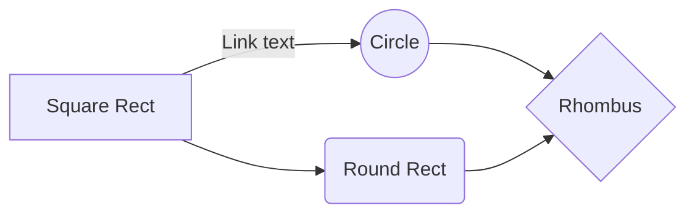
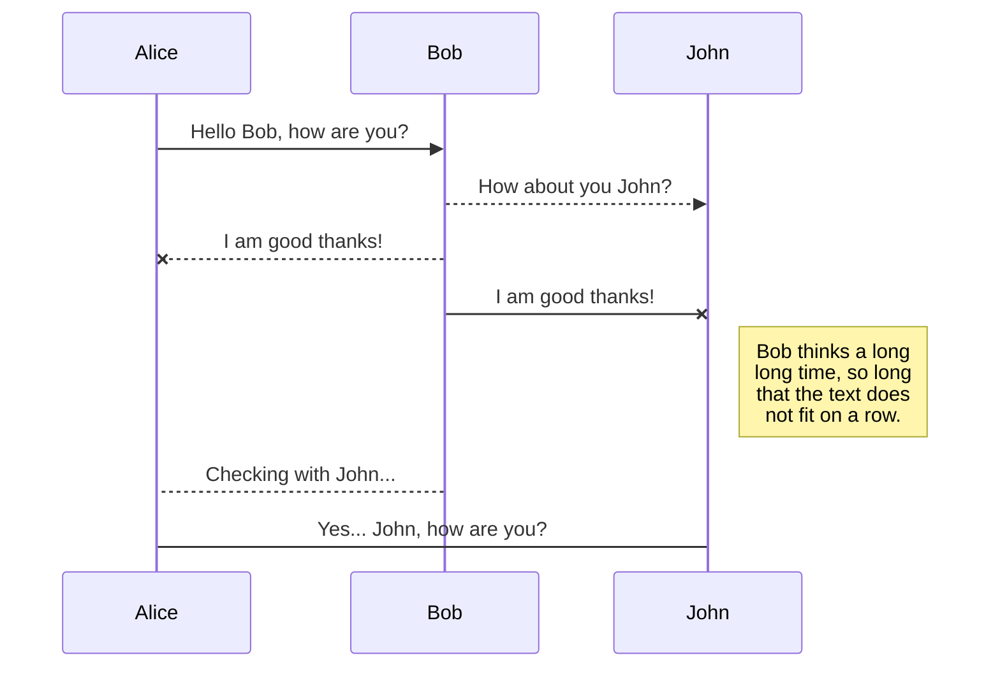
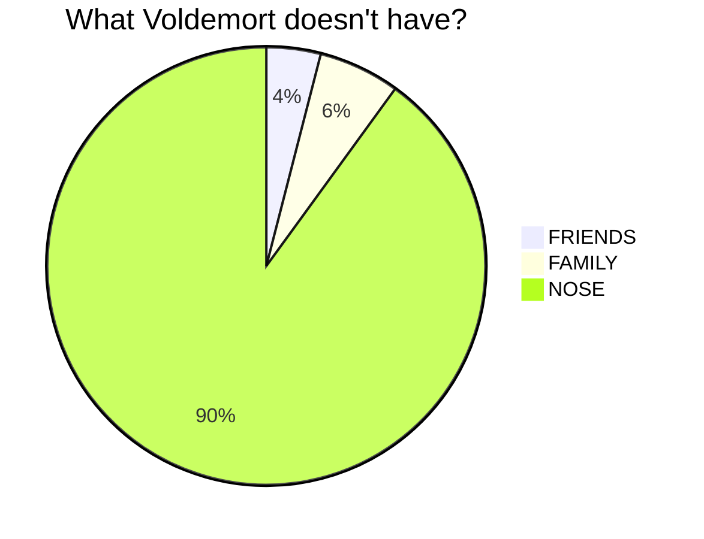
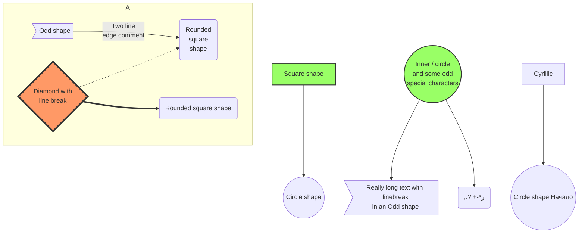

# Sample Document

Inline math: $E = mc^2$ and display:

$$
\int_0^1 x^2 \, dx = \frac{1}{3}
$$

## Lists

- First item
- Second item with **bold** and *italic*

> A blockquote for immersive reading.

```python
def hello():
    print("emede")
```

| Col A | Col B |
|-------|-------|
| one   | two   |











