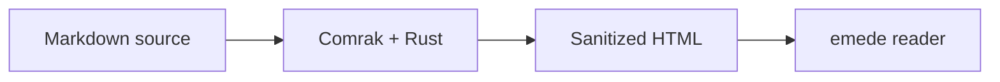
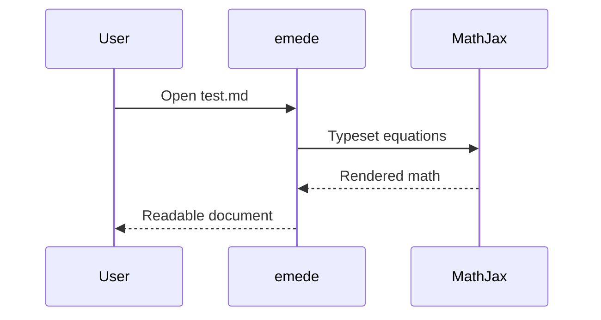
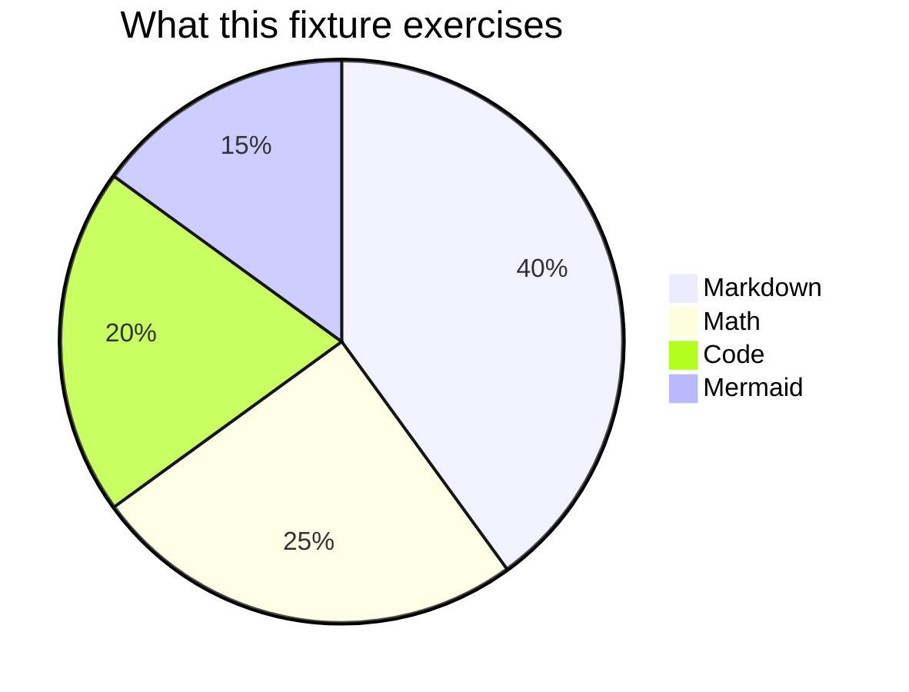

# emede rendering showcase

This document is a feature tour for **emede**, a read-only Markdown reader. It
contains ordinary *emphasis*, **strong text**, ~~strikethrough~~, `inline code`,
and a [link to the project README](README.md). It also has a remote link to
[the CommonMark site](https://commonmark.org), an autolink
<https://github.com>, and an email address: <hello@example.com>.

The front matter above is rendered as a YAML code block. The title is also used
for the document window and recent-file entry.

## Contents and headings

The table of contents includes headings through this level. The remaining
levels are included to exercise the complete heading range:

### Third-level heading

#### Fourth-level heading

##### Fifth-level heading

###### Sixth-level heading

You can jump to the [mathematics section](#mathematics) or back to the
[top of this document](#emede-rendering-showcase).

## Paragraphs, quotes, and breaks

Soft-wrapped source lines become one paragraph. An explicit `<br>` creates a
hard line break here.<br>
This is the next line in the same paragraph.

> A blockquote can contain **formatting** and multiple paragraphs.
>
> It can also contain a nested quote:
>
> > Read-only documents are intentionally calm.

---

## Lists and task lists

An unordered list can be nested and mixed with an ordered list:

- Research tooling
  - Markdown rendering
  - Math typesetting
  - Mermaid diagrams
- Reader controls
  1. Open a document
  2. Search within the document
  3. Inspect the table of contents

Task lists preserve their checked state:

- [x] Render Markdown with Comrak
- [x] Sanitize unsafe HTML
- [ ] Add a new note
- [ ] Share a document over the LAN

## Tables

Tables support alignment and inline formatting:

| Feature | Syntax | Status |
| :--- | :---: | ---: |
| Emphasis | `*text*` | **Ready** |
| Math | `$x^2$` | **Ready** |
| Diagrams | `mermaid` fence | **Ready** |
| Tasks | `- [ ] item` | **Ready** |

## Mathematics

Inline math uses dollar delimiters: $E = mc^2$, $\alpha + \beta = \gamma$,
and $\sum_{i=1}^{n} i = \frac{n(n+1)}{2}$.

Display math uses `$$...$$`:

$$
\int_0^1 x^2\,dx = \frac{1}{3}
$$

Pandoc-style delimiters are accepted too:

\[
\nabla \cdot \mathbf{E} = \frac{\rho}{\varepsilon_0}
\]

\( f(x) = \exp(-x^2) \)

The `math` fence is converted to display math:

```math
\begin{aligned}
  x_{t+1} &= x_t + v_{t+1} \\
  v_{t+1} &= \omega v_t + c_1 r_1(p_t-x_t) + c_2 r_2(g_t-x_t)
\end{aligned}
```

## Code blocks

Inline code such as `cargo test`, `RenderResult`, and ``a `backtick` inside``
is kept literal. Fenced blocks retain their language class for styling.

```julia
function sphere(x)
    return sum(abs2, x)
end

population = [[-2.0, 1.0], [0.5, 3.0]]
best = argmin(sphere, population)
```

```rust
fn main() {
    let message = "Hello from emede";
    println!("{message}");
}
```

```python
def greet(name: str) -> str:
    return f"Hello, {name}!"
```

```json
{
  "reader": "emede",
  "offline": true,
  "features": ["markdown", "math", "mermaid"]
}
```

## Images and links

This intentionally missing image exercises emede's image fallback UI:


Links to local Markdown files are opened inside emede. This one points to a
missing file so the linked-file error dialog can be tested:

[Open the missing companion](ThisNotExsists.md)

## Mermaid diagrams

Mermaid fenced blocks are replaced with diagrams when Mermaid is enabled in
Settings.


```mermaid
flowchart LR
    source[Markdown source] --> rust[Comrak + Rust]
    rust --> html[Sanitized HTML]
    html --> reader[emede reader]
```


```mermaid
sequenceDiagram
    participant U as User
    participant E as emede
    participant M as MathJax
    U->>E: Open test.md
    E->>M: Typeset equations
    M-->>E: Rendered math
    E-->>U: Readable document
```


```mermaid
pie title What this fixture exercises
    "Markdown" : 40
    "Math" : 25
    "Code" : 20
    "Mermaid" : 15
```

## Sanitized HTML

Some raw HTML is useful in a Markdown reader. This paragraph contains a
keyboard hint with `<kbd>Ctrl</kbd> + <kbd>Shift</kbd> + <kbd>T</kbd>`, while
unsafe scripts and event handlers are removed by the renderer.

<details>
<summary>Details element</summary>

This is a raw HTML block. Whether it remains interactive depends on the
sanitizer's allow-list.
</details>

## Reader-friendly ending

The horizontal rule above, the headings, table, diagrams, equations, code,
links, image states, and statistics panel all make this file useful as a
manual smoke test for emede.
